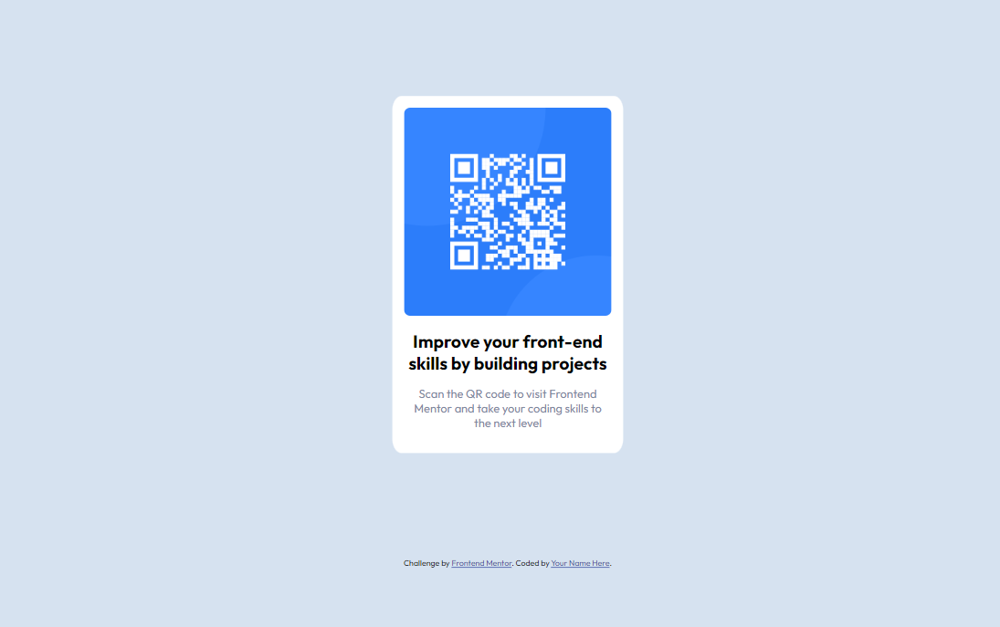

# Frontend Mentor - QR code component solution

This is a solution to the [QR code component challenge on Frontend Mentor](https://www.frontendmentor.io/challenges/qr-code-component-iux_sIO_H). Frontend Mentor challenges help you improve your coding skills by building realistic projects.

## Table of contents

- [Overview](#overview)
  - [Screenshot](#screenshot)
  - [Links](#links)
- [My process](#my-process)
  - [Built with](#built-with)
  - [What I learned](#what-i-learned)
  - [Continued development](#continued-development)
  - [Useful resources](#useful-resources)
- [Author](#author)
- [Acknowledgments](#acknowledgments)

## Overview

### Screenshot

### Links

- Solution URL: ([[https://your-solution-url.com](https://github.com/ruffwise/QR-code-component.git)](https://github.com/ruffwise/QR-code-component.git))
- Live Site URL:([[https://your-live-site-url.com](https://ruffwise.github.io/QR-code-component/)](https://ruffwise.github.io/QR-code-component/))

## My process

### Built with

- Semantic HTML5 markup
- CSS custom properties
- Flexbox
- Mobile-first workflow

### What I learned

I did this project just after doing the Product-preview-card, so, this challenged basically helped me fine tune my css skills on flexbox.

### Continued development

Next plan is to do more challenges to fine-tune my basic CSS skills

### Useful resources

## Author

- Website - [ruffwise](https://www.your-site.com)
- Frontend Mentor - [@ruffwise](https://www.frontendmentor.io/profile/ruffwise)

## Acknowledgments
